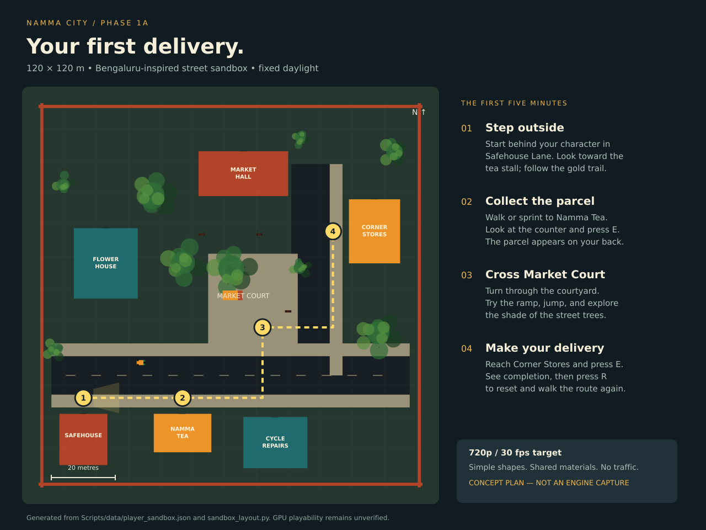

# Namma City

An original Bengaluru-inspired Unreal game. The active milestone is **Phase 1A: First Delivery** — a stylized 120 × 120 m third-person street block, targeting **720p / 30 fps on the existing i7-1360P / 15 GiB / Intel integrated-GPU machine**. The 2 × 2 km district is a later, profiling-gated ambition.

[View the annotated starting point](docs/phase-1/starting-point.svg) · [Implementation and verification status](docs/phase-1/STATUS.md) · [Workstation constraints](docs/performance/BASELINE.md)

## Run the first playable

The editor target builds locally. The player now has a skeletal mannequin, joint animation, foot/crouch IK, Chaos ragdoll, and physics pickup. See [human movement setup and current limits](docs/phase-1/HUMAN_MOVEMENT.md). Desktop Vulkan access is required for visual playtesting.

1. Follow [workstation setup](docs/namma-city/docs/software/UBUNTU_22_04_SETUP.md), review [storage candidates](docs/phase-1/STORAGE_REVIEW.md), and install Epic's precompiled Linux UE5 build outside the repo.
2. Run `python3 Scripts/configure_engine.py /absolute/path/to/UnrealEngine` to write local `.env` and the actual version pin. Commit `Config/UnrealVersion.json` once selected; never commit `.env`.
3. Run `Scripts/test_host.sh` for engine-independent checks.
4. Run `Scripts/build_editor.sh` **before** either generator; the sandbox requires the compiled C++ classes.
5. Run `Scripts/create_smoke_test_map.sh`, `Scripts/create_player_sandbox.sh`, then `Scripts/setup_human_character.sh`.
   Run `Scripts/setup_trees.sh` to grow the street trees in the finished map; re-run it after editing the tree layout.
6. Run `Scripts/launch_editor.sh` and use Play, or run `Scripts/build_game.sh`, `Scripts/package_game.sh`, then `Scripts/launch_game.sh` for the standalone game.

WASD moves, mouse looks, Shift sprints, Space jumps, C crouches, E interacts with a nearby counter, F grabs/drops a light physics object, X enters ragdoll or resets, and Escape pauses. R restarts from pause or completion; Q quits from pause. Follow the gold trail from the safehouse to Namma Tea, through Market Court, and on to Corner Stores. The parked auto-rickshaw is scenery.

## Project references

- [Phase 0 status](docs/phase-0/STATUS.md)
- [Phase 1A acceptance checklist](docs/phase-1/PLAYTEST.md)
- [Full design documentation](docs/namma-city/docs/README.md) — future systems are design intent, not implemented gameplay.
- [Graphify knowledge graph](graphify-out/graph.html) — centralized outside the repo; use [implementation status](docs/phase-1/STATUS.md) to distinguish code from plans.
